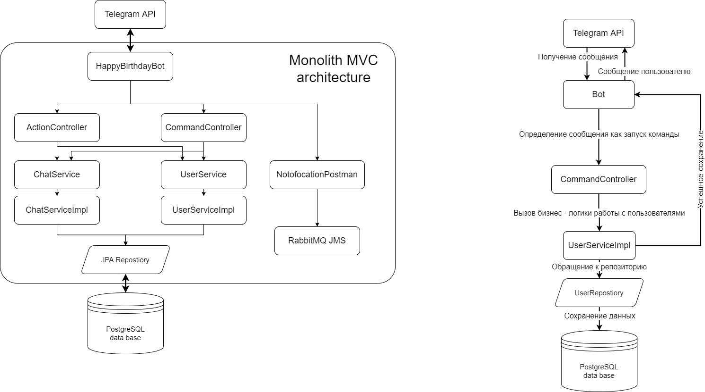

# HappyBirthdayBot

Телеграм Бот, разработанный в рамках индивидуальной проектной работы в Университете ИТМО  

[@HappyBirthdayBot](https://t.me/ITMOHappyBirthdayBot) создан для напоминаний о Днях Рождения друзей и собеседников в Telegram  
Для начала работы можно добавить бота в групповой чат или запустить самостоятельно командой /start

В корневой директории находится полноценный дизайн-документ в формате .pdf

## Возможности
На данный момент бот поддерживает следующий функционал:
* Автоматическая регистрация и заполнение дополнительных данных
* Добавление в групповой чат и связывание участников
* Добавление друзей вне групповых чатов
* Содание и редактирование собственного wishlist-а
* Напоминания о скорых Днях Рождения с предложениями идей подарков
* Просмотр всех Дней Рождения в ближайший месяц
* Настройка напоминаний с регулированием интервала
* Дополнительные информационные команды

## Стек разработки:
 - Spring Boot
 - PostgreSQL + FlyWay Migrations
 - Hibernate, Spring Data JPA
 - Telegram Bot Java Library
 - RabbitMQ messaging broker
 - Maven

Для развертывания приложения используется Google Cloud Platform

## Архитектура приложения

Архитектура приложения представляет собой монолит с применением MVC структуры для ослабления связей и повышения готовности к масштабированию. 
В соответствии с MVC архитектурой приложение разделяется на три уровня:
1.	Обмен данными происходит через спецификацию, предоставляемую Телеграмм, а также через библиотеку Telegram Bot Java Library. Передаваемые объекты – DTO классы со всей информацией о принятом сообщении или действии с ботом.
2.	Бизнес-логика в зависимости от типа действия или команды обрабатывает запрос и при необходимости обращается через сервисный уровень к информационной системе (базе данных).
3.	В зависимости от команды или данных пользователь через Telegram API получает необходимое сообщение или отчет о выполненном действии.

Сервисный уровень реализует работу с данными и их хранение в базе данных через репозитории. 
Отдельно стоит отметить асинхронную отправку и получение сообщений через брокера. Такой подход позволит не потерять данные и обеспечит повышенную производительность.

Выбор монолитной архитектуры обоснован бизнес-логикой приложения. Каждое действие пользователя является неразрывной логической единицей и обрабатывается одним набором контроллеров и одной базой данных. Асинхронность для обмена сообщениями реализована через программный брокер сообщений.

